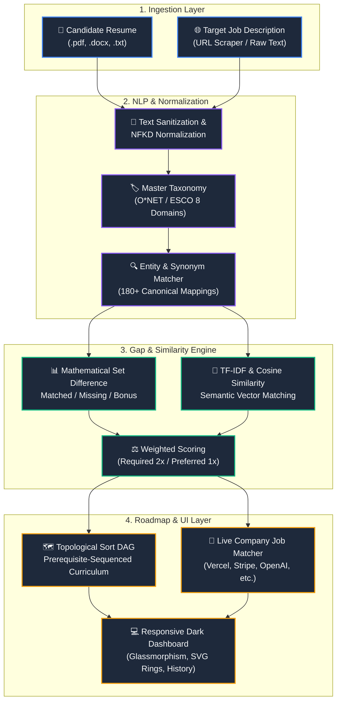

<div align="center">

# 🎯 SkillGap AI
### Intelligent Skill-Gap Analyzer, Matcher & Career Roadmap Engine

An end-to-end intelligence platform that parses unstructured resumes, scrapes target job descriptions, reconciles technical skills against standardized O*NET/ESCO taxonomies, computes mathematical gap scores, and sequences personalized learning roadmaps.

[](https://www.python.org/)
[](https://fastapi.tiangolo.com/)
[](./tests)
[](#-architecture-overview)
[](#-license)

<br/>

[🚀 Quick Start](#-quick-start) •
[🏛️ Architecture](#-architecture-overview) •
[✨ Key Features](#-key-features) •
[📁 Project Structure](#-project-structure) •
[📡 API Reference](#-api-endpoints) •
[📱 GitHub Responsive Guide](#-step-by-step-guide-creating-responsive-readmes-on-github)

</div>

---

## 🏛️ Architecture Overview

The system processes resumes through a 6-phase analytical pipeline using natural language processing, vector similarity, and directed acyclic graph (DAG) topological scheduling.



---

## ✨ Key Features

| Feature | Description |
| :--- | :--- |
| **Multi-Format Ingestion** | Extracts text from `.pdf` (via `pypdf` & client PDF.js), `.docx` (via `python-docx` & Mammoth.js), and `.txt`. |
| **URL Job Scraper** | Scrapes job posting requirements directly from web URLs with automatic HTML cleanup. |
| **O\*NET/ESCO Taxonomy** | Recognizes 100+ skills across 8 core domains (Languages, Frontend, Backend, Databases, Cloud/DevOps, Data/AI, Architecture, Soft Skills). |
| **Weighted Set Difference** | Distinguishes essential qualifications (2.0x weight) from preferred differentiators (1.0x weight). |
| **Semantic Cosine Similarity** | Computes sublinear TF-IDF vector embeddings between resume background and role requirements. |
| **Topological Curriculum** | Orders learning milestones using Kahn's topological sort over prerequisite graphs (e.g., HTML/CSS → JavaScript → React → Next.js). |
| **1-Click Career Matches** | Matches verified candidate competencies against active company openings with direct application portal links. |
| **Dual Execution Modes** | Runs with a full FastAPI/SQLite server or 100% offline in any browser via standalone mode. |

---

## 🚀 Quick Start

### Mode 1: 1-Click Standalone (No Installation Required)

Simply double-click [`frontend.html`](./frontend.html) or open it directly in your browser:

```bash
# Windows
start frontend.html

# macOS
open frontend.html

# Linux
xdg-open frontend.html
```

> **Note**: The standalone client runs fully in-browser with client-side PDF/DOCX parsing, NLP extraction, gap analysis, and SVG charting.

---

### Mode 2: Full Server & REST API (FastAPI + SQLite)

#### 1. Clone the repository
```bash
git clone https://github.com/your-username/skillgap-ai.git
cd skillgap-ai
```

#### 2. Install dependencies
```bash
pip install -r requirements.txt
```

#### 3. Launch the application
```bash
python backend.py
```
*Or using Uvicorn directly:*
```bash
python -m uvicorn backend.main:app --host 127.0.0.1 --port 8000 --reload
```

#### 4. Open in browser
- **Dashboard**: [http://127.0.0.1:8000](http://127.0.0.1:8000)
- **Interactive Swagger Docs**: [http://127.0.0.1:8000/docs](http://127.0.0.1:8000/docs)
- **ReDoc Specification**: [http://127.0.0.1:8000/redoc](http://127.0.0.1:8000/redoc)

---

## 📁 Project Structure

The codebase is organized into a clean two-tier architecture (`frontend/` and `backend/`):

```
skils/
├── frontend/                     # [FRONTEND] UI, Styles, Client Scripts & Assets
│   ├── index.html                # Modern interactive dashboard UI
│   ├── style.css                 # Dark slate glassmorphic stylesheet
│   ├── app.js                    # Reactive controller & API integration
│   └── standalone.html           # Offline-capable client bundle
│
├── backend/                      # [BACKEND] APIs, NLP & Analytics Engines
│   ├── main.py                   # FastAPI application & REST routing
│   ├── config.py                 # File constraints, scoring multipliers & settings
│   ├── database.py               # SQLite schema, persistence, and querying
│   ├── samples.py                # Preloaded sample candidate & job profiles
│   ├── parsers/
│   │   ├── resume_parser.py      # PDF, DOCX, and TXT document extractor
│   │   ├── jd_scraper.py         # Live web scraper for job URLs
│   │   └── text_cleaner.py       # Unicode NFKD cleaner & section segmenter
│   ├── nlp/
│   │   ├── taxonomy.py           # O*NET/ESCO Master taxonomy & synonym dictionary
│   │   └── skill_extractor.py    # Entity boundary matcher & section tagger
│   └── engine/
│       ├── vector_similarity.py  # TF-IDF embeddings & cosine similarity
│       ├── gap_analyzer.py       # Set difference & weighted scoring engine
│       ├── learning_path.py      # Prerequisite DAG & Kahn's topological sort
│       └── job_matcher.py        # Candidate skill matching & company career links
│
├── backend.py                    # 🚀 1-Click Server Launcher
├── frontend.html                 # 🚀 1-Click Standalone Browser Client
├── samples/                      # Sample resumes (.pdf, .docx, .txt) & generator
├── tests/                        # 28 Automated Unit & Integration Tests
└── requirements.txt              # Production dependencies
```

<details>
<summary><b>🔍 Click to view detailed test suite breakdown (28/28 tests passing)</b></summary>

```
tests/
├── test_parsers.py        # HTML stripping, NFKD unicode, segmentation, PDF/DOCX/TXT
├── test_nlp.py            # Synonym normalization, taxonomy integrity, word boundaries
├── test_engine.py         # Vector similarity, disjoint penalty, weighted set scoring
├── test_learning_path.py  # Topological sorting, cycle handling, milestone enrichment
└── test_api.py            # FastAPI endpoints, file uploads, SQLite history persistence
```

Run test suite:
```powershell
python -m unittest discover -s tests -p "test_*.py"
```
</details>

---

## 📡 API Endpoints

| Method | Endpoint | Description |
| :--- | :--- | :--- |
| `POST` | `/api/analyze` | Multipart upload for `.pdf`, `.docx`, `.txt` or raw text with optional target JD. |
| `POST` | `/api/analyze/direct` | JSON endpoint accepting `{ resume_text, jd_text, candidate_name, job_title }`. |
| `POST` | `/api/scrape-jd` | Fetches and sanitizes job posting prose from any web URL. |
| `GET` | `/api/samples` | Retrieves industry sample profiles for 1-click benchmarking. |
| `GET` | `/api/history` | Fetches historical candidate evaluations from SQLite. |
| `GET` | `/api/history/{id}` | Retrieves a specific evaluation report by ID. |
| `DELETE`| `/api/history/{id}` | Removes a historical evaluation record. |
| `GET` | `/health` | System liveness probe and health check. |

---

## 📱 Step-by-Step Guide: Creating Responsive READMEs on GitHub

GitHub renders Markdown inside its own container with specific security and layout rules. To ensure your README looks great on **desktop monitors**, **tablets**, and the **GitHub Mobile App**, follow these principles:

### Step 1: Use Native Mermaid Instead of Fixed ASCII Art
- **Avoid**: Large text-box diagrams (`┌────┐`) wider than 70 characters. On mobile screens, they cause extreme horizontal scrolling or break layout.
- **Use**: GitHub's native ` ```mermaid ` blocks. GitHub renders them as scalable SVG vector diagrams that automatically fit any screen width:
  ```markdown
  ```mermaid
  flowchart LR
      A[Resume] --> B[NLP Extractor]
      B --> C[Gap Engine]
      C --> D[Roadmap]
  ```
  ```

### Step 2: Use Relative Repository Links
- **Avoid**: Absolute local file paths like `file:///C:/Users/...` or hardcoded machine paths. GitHub blocks local URLs for security reasons.
- **Use**: Relative Markdown paths:
  ```markdown
  [Launch Frontend](./frontend.html)
  [View Stylesheet](./frontend/style.css)
  ```

### Step 3: Responsive Images and Media
- **Avoid**: Fixed pixel dimensions like ``.
- **Use**: Fluid widths or percentage constraints:
  ```html
  <p align="center">
    
  </p>
  ```
- **Light/Dark Mode Images**: Use GitHub's `#gh-dark-mode-only` and `#gh-light-mode-only` anchors:
  ```html
  <picture>
    <source media="(prefers-color-scheme: dark)" srcset="./assets/banner-dark.png">
    <source media="(prefers-color-scheme: light)" srcset="./assets/banner-light.png">
    
  </picture>
  ```

### Step 4: Clean, Scalable Badges with Shields.io
- Use the `for-the-badge` or `flat-square` styles from [Shields.io](https://shields.io/).
- Group badges cleanly inside `<div align="center">` or Markdown tables so they wrap naturally on narrow screens:
  ```markdown
  [](https://www.python.org/)
  ```

### Step 5: Responsive Tables
- Keep tables to **2 to 3 columns maximum**. On mobile, tables with 5+ columns require horizontal scrolling.
- Use bullet points inside table cells instead of long run-on sentences.

### Step 6: Collapsible `<details>` for Deep Content
- Long code blocks, configuration files, and terminal logs should be tucked into `<details>` elements.
- This keeps the README readable and easy to scan on phones:
  ```html
  <details>
    <summary><b>Click to expand full configuration</b></summary>

    ```python
    MAX_FILE_SIZE_MB = 10
    ALLOWED_EXTENSIONS = [".pdf", ".docx", ".txt"]
    ```
  </details>
  ```

### Step 7: Universal Unicode Symbols Instead of Complex LaTeX Math
- While GitHub supports KaTeX (`$...$`), mobile browsers or third-party Git clients often display broken equations if syntax errors occur (like unescaped `\%`).
- For universal compatibility, use clean Unicode arrows and formulas:
  - Use `→` instead of `$\to$`
  - Use `✓` instead of LaTeX checkmarks
  - Use clear text formulas: `Skill Match = (Matched Weight / Total Weight) × 100`

---

## 🌐 Free 1-Click Hosting via GitHub Pages

You can host the standalone frontend directly on GitHub Pages for free without spinning up any server:

1. Push this repository to GitHub:
   ```bash
   git add .
   git commit -m "feat: complete skill-gap analyzer"
   git push origin main
   ```
2. In your GitHub repository, go to **Settings** → **Pages**.
3. Under **Build and deployment** → **Source**, select **Deploy from a branch**.
4. Set Branch to `main` and folder to `/ (root)` or `/frontend`.
5. Click **Save**. Within 60 seconds, your application will be live at:
   `https://<your-username>.github.io/<repo-name>/frontend.html`

---

## 📄 License

Distributed under the **MIT License**.
